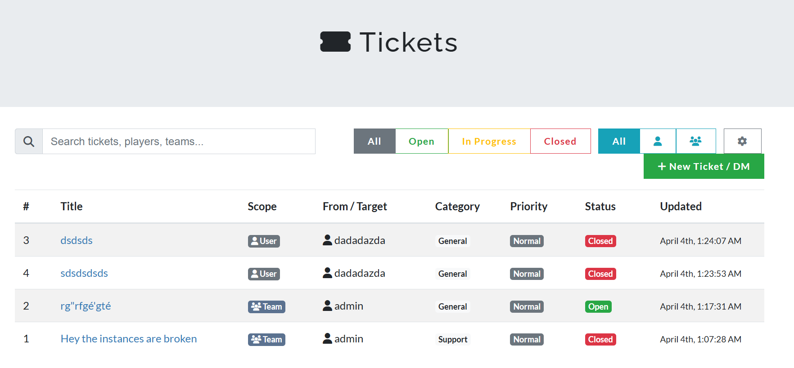
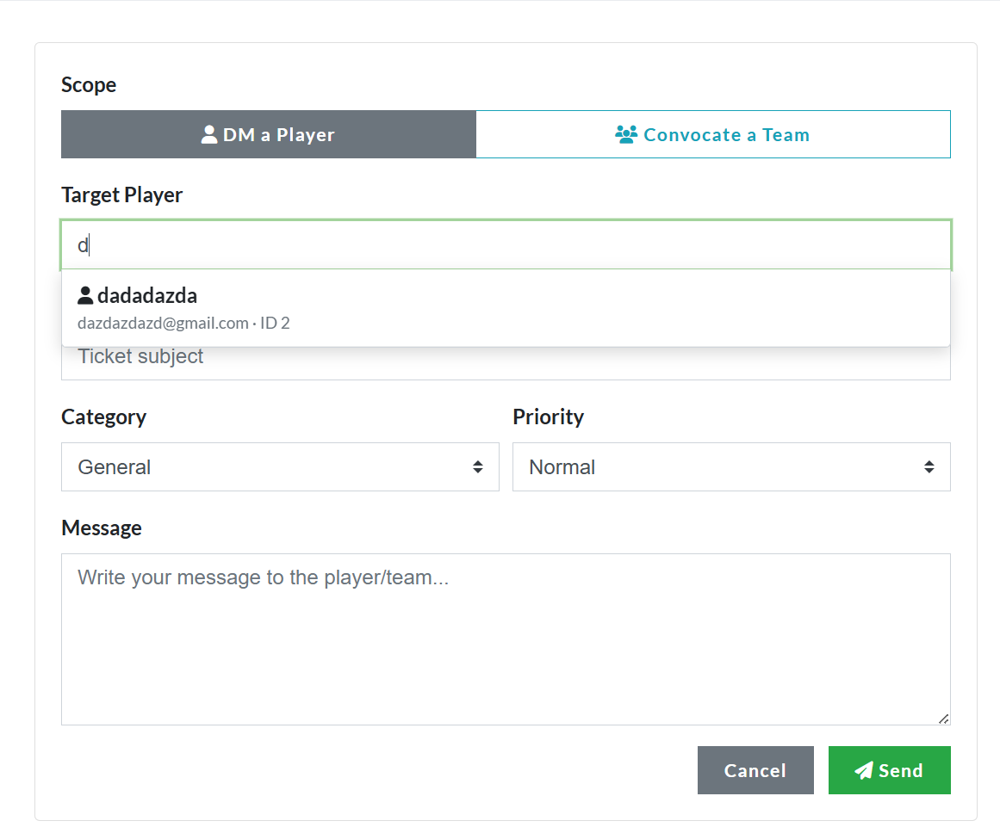
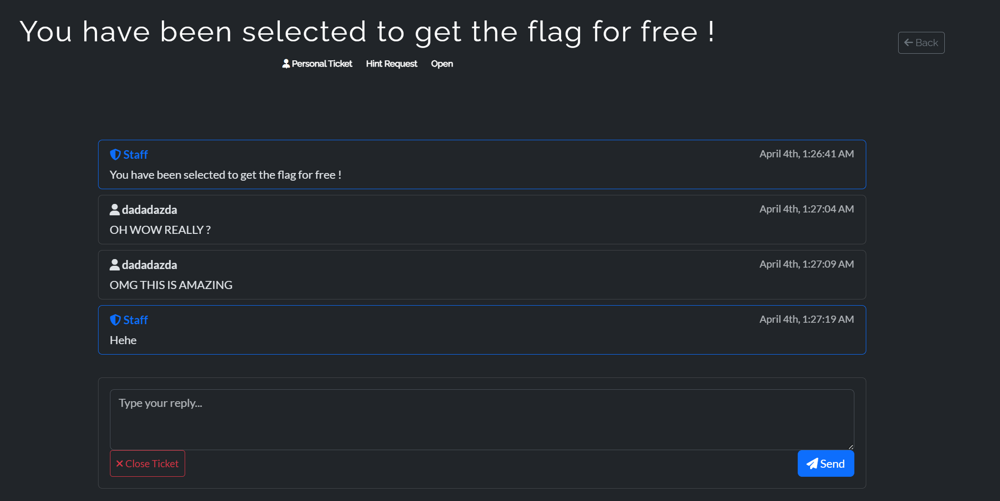
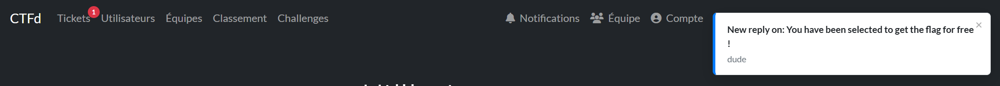

# CTFd Tickets

A ticket/messaging plugin for CTFd. Lets admins DM players, convocate teams, and manage support tickets directly from the platform.

## Features

- **Player tickets** - Users can open personal or team-wide support tickets
- **Admin DMs** - Admins can message any player or team directly from the admin panel
- **Team convocations** - Open a ticket visible to all members of a team
- **Live chat** - Conversations update in real time without page reloads
- **Targeted notifications** - Toast popups with sound + red unread badge on the Tickets nav link, only visible to the intended recipient(s)
- **Searchable** - Player/team search with autocomplete (scales to thousands of users)
- **Ticket limits** - Configurable max open tickets per user and per team
- **Custom categories** - Admins can add, remove, and reorder ticket categories
- **Theme compatible** - Extends CTFd's admin and core base templates, works with any theme

## Screenshots









## Installation

1. Clone this repository into your CTFd plugins directory:

```
cd CTFd/plugins
git clone https://github.com/Leclowndu93150/CTFd-Tickets.git tickets
```

2. Restart CTFd. The plugin creates its database tables automatically on startup.

## Usage

**Admin side:**
- A "Tickets" link appears in the admin navbar
- Click "New Ticket / DM" to message a player or convocate a team
- Use the search bar and filters to manage tickets
- Go to Settings (gear icon) to configure categories and ticket limits

**Player side:**
- A "Tickets" link appears in the user navbar
- Players can create personal or team-wide tickets
- Unread tickets show a red badge on the nav link
- New messages trigger a toast notification with sound

## Configuration

All settings are managed from `/admin/tickets/settings`:

| Setting | Description | Default |
|---------|-------------|---------|
| Per User Limit | Max open personal tickets per player | 0 (unlimited) |
| Per Team Limit | Max open team-wide tickets per team | 0 (unlimited) |
| Categories | List of ticket categories players can choose from | General, Support, Report, Infraction, Hint Request |

## License

Apache-2.0
